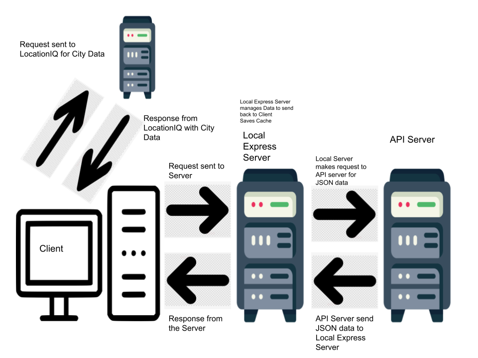

# Read Me

**Author**: Emmanuel Gonzales

**Version**: 1.0.0

## Overview

This site is used to browse major cities in the US. It uses of APIs as a data base for all the cites.

## Getting Started

The user needs to design a form, locate a geocoding API to use, along with libraries like react and axios.

## Architecture

This site is made with React. It uses bootstrap for functionality and axios to implement the API

## Change Log

Name of feature: Setting Up Repo

Estimate of time needed to complete: 30 mins

Start time: 4:45

Finish time: 6:00

Actual time needed to complete: 1hr 15mins

Name of feature: Location Form

Estimate of time needed to complete: 45 mins

Start time: 6:12
Finish time: 8:08

Actual time needed to complete: 2hrs

Name of feature: Location, Map, and Error Implementation

Estimate of time needed to complete: 45 mins

Start time: 6:12
Finish time: 8:08

Actual time needed to complete: 2hrs

## Credit and Collaborations

Acc Partners: Logan Reese Chris.

